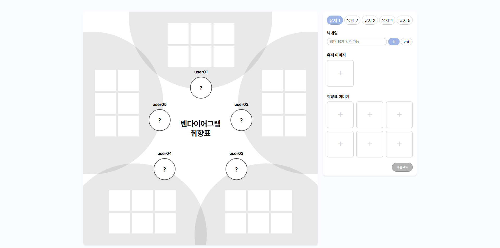
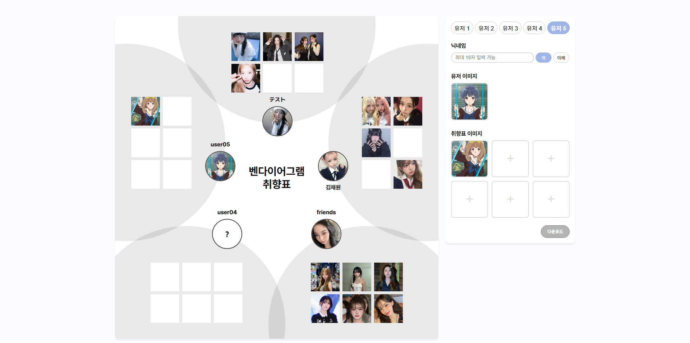

# Taste Map Maker

友人関係の中で、それぞれの好み（人物、キャラクターなど）を**マップ形式のダイアグラム**として可視化する Web ツールです。

これまで画像編集ツールで手作業していた「趣味共有用の図」を、Web 上で直感的に編集・保存できる形にすることを目的として開発しました。

🔗 **デモページ**：https://taste-map-maker.vercel.app  
🔗 **GitHub リポジトリ**：https://github.com/oorthing/taste-map-maker

 

---

 

## サンプル

作成した内容は画像として保存可能

### PC画面

  
  

### モバイル画面

  

 

## 特徴

### 👥 関係性ベースの趣味可視化
- 最大 **5 人**までのユーザーを 1 つのマップとして表現
- 各ユーザーごとに以下を設定可能：
  - ニックネーム
  - タイトル表示位置（上 / 下）
  - ユーザーアイコン
  - 趣味画像（複数）

### 🖼️ 編集・プレビュー
- ファイルアップロードによる画像登録
- 状態変更に応じたリアルタイムプレビュー
- 画面幅に応じた自動スケーリング

### 📥 画像ダウンロード
- 完成したマップを **PNG 画像（1440 × 1440）**として保存
- フォント・画像の読み込み完了を待ってからキャプチャを実行し、
  レイアウト崩れを防止
- iOS Safari 環境では、新規タブで画像を表示

 

## プロジェクト背景

本プロジェクトは、**友人同士で趣味を共有するために PDF 形式で作成された図**を見た経験をきっかけに着想しました。

画像編集ツールによる作業は、修正や再利用が難しく、少し変更するだけでも作り直しが必要になるという課題があります。

そこで、「何度でも編集でき、すぐに共有できる形」にするため、Web ベースのツールとして再構築しました。

形式はベン図に近い構成ですが、**共通点を分析するための図ではなく、関係性の中でそれぞれの趣味を並べて見せること**を目的としています。

 

## UI / UX 設計方針

### 未設定状態の表現について

- **ユーザーアイコン**
  - 未設定状態を明確に示すため、中央に「?」を表示
  - 「誰なのかがまだ決まっていない」ことを直感的に表現

- **趣味画像スロット**
  - 意味を強く主張しないよう、あえて何も表示しない設計
  - 画面全体のノイズを抑え、構造を把握しやすくしています

同じ「未設定」状態でも役割が異なるため、ユーザー要素と趣味要素で表現を分けています。

 

## 画像キャプチャ実装について

本ツールでは、**画面表示とダウンロード画像の内容を完全に一致させること**を重視しています。

- 画像が設定されている場合  
  → Canvas API を使用して画像を直接描画
- 画像が未設定の場合  
  → 画面表示と同じスタイルで  
    テキスト「?」を Canvas 上に描画

DOM をそのまま画像化するのではなく、**表示状態を元に Canvas 上で再描画する方式**を採用することで、

- フォントや画像の読み込みタイミングによる差異
- ブラウザ間の表示差

を抑え、安定した出力を実現しています。

 

## 技術スタック

- **HTML5**
- **CSS3**
  - Flexbox / Grid
  - レスポンシブ対応
- **Vanilla JavaScript**
  - 状態管理
  - DOM 操作
  - Canvas API
- **Vercel**
  - 静的サイト配信

 

## 構成

- **view.html**
- **editor.html**
- **app.js**
  - アプリ初期化・エントリーポイント
- **editor.js**
  - 入力処理・状態更新
- **view.js**
  - プレビュー描画・画像キャプチャ
- **reset.css**
- **editor.css**
- **view.css**

 

## 制限事項

- 現在のユーザー数は **5 人固定**
- モバイルでも閲覧可能ですが、編集・ダウンロードは PC 環境を推奨
- iOS Safari ではダウンロード時に新規タブで画像が表示される場合があります

 

## 今後の改善案

- ユーザー数の可変対応
- ダークモード対応
- レイアウトプリセット切り替え

 

## Author

個人開発プロジェクト  

目的：
- UI 設計力の向上
- 状態管理と DOM 操作の整理
- Canvas API を用いた画像キャプチャ実装
- 実務で発生しやすい描画差異への対応経験整理

 

## License

本プロジェクトは、個人利用およびポートフォリオ用途を目的としています。
